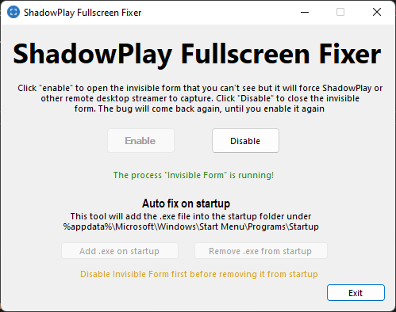

# ShadowPlay Fullscreen Fixer
A simple tool that temporary fixes fullscreen bug for ShadowPlay and maybe other remote desktop softwares. I made this since 2016. Seems to have been fixed since Chrome 61.0.3163.100 or earlier. This tool is not useful anymore, maybe again in the future =D

# How it works?
This tool opens an invisible form on top-left corner that you can't see. The opacity is 1% and it is not visible for you. 0% does not fix the problem as the form will be completely hidden. You can click through the form, so it does not disturb you or annoy you. When you enable it, it will extract the .exe on %AppData%\Local\Invisible Form and execute from there

Enable auto fix on startup will add the .exe file at %appdata%\Microsoft\Windows\Start Menu\Programs\Startup.

The invisible form uses 2.3 MB of RAM. Process name "Invisible Form" 

# How i found the workaround
It took me a month to find the solution. First, i go to Nvidia control panel and switch to high performance, it worked, but after i update Google Chrome, it does not work anymore. I played with chrome://flags but no luck. Few weeks later, i found out that Bandicam temporary fix the problem because the floating window fixes it, then I reproduced by creating my own floating invisible window which fixes the problem

You can disable the hardware acceleration in Google Chrome settings but it is not recommended!
